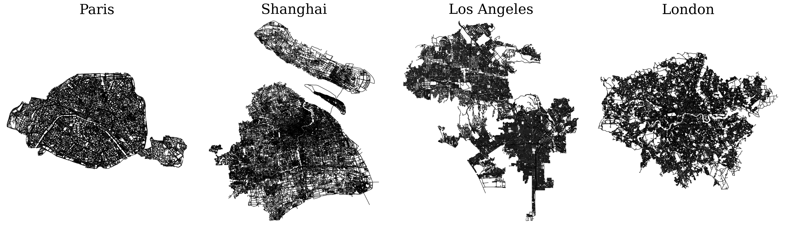
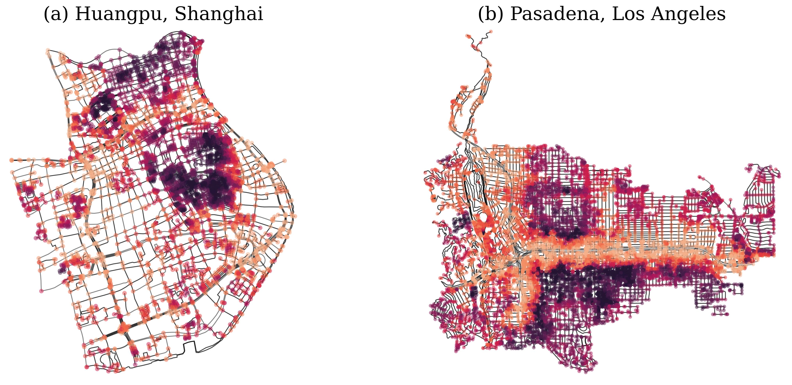
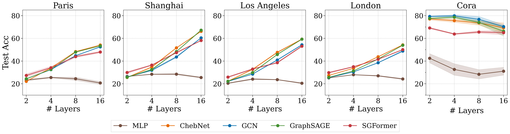
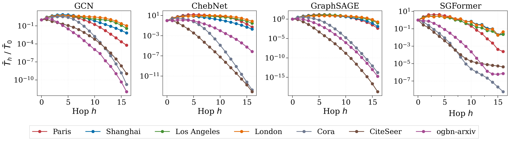

# City-Networks
We introduce [**City-Networks**](https://pytorch-geometric.readthedocs.io/en/latest/generated/torch_geometric.datasets.CityNetwork.html?highlight=city#torch_geometric.datasets.CityNetwork), a transductive learning dataset for testing long-range dependencies in Graph Neural Networks (GNNs).
In particular, our dataset contains four large-scale city maps: Paris, Shanghai, L.A., and London, where nodes represent intersections and edges represent road segments.

**Paper: [Towards Quantifying Long-Range Interactions in Graph Machine Learning: a Large Graph Dataset and a Measurement
](https://arxiv.org/abs/2503.09008).**

<div align="center">
  
</div>


## Visualization
The nodes are labeled by an approximation of eccentricity, which measures the accessibility of a node in the network. We visualize two sub-regions in our dataset below, 
where darker color indicates lower node eccentricity (i.e. more accessible). 

<div align="center">
  
</div>

A more detailed discussion can be found in the [paper](https://arxiv.org/abs/2503.09008).


## Load as a PyG Dataset
You can easily use the `CityNetwork` class from `citynetworks.py` to load our dataset as a PyG InMemory Dataset.

Example usage:
```python
from citynetworks import CityNetwork

dataset = CityNetwork(root="./city_networks", name="paris")
paris_network = dataset[0]
```
Here `name` takes values in `[paris, shanghai, la, london]`

**Update**: We are currently integrating our dataset into [Pytorch Geometric](https://pytorch-geometric.readthedocs.io/en/latest/index.html), and you can now access [CityNetwork](https://pytorch-geometric.readthedocs.io/en/latest/generated/torch_geometric.datasets.CityNetwork.html?highlight=city#torch_geometric.datasets.CityNetwork) from the latest version of PyG by installing the nightly version:
```bash
pip install pyg-nightly
```
or from the master:
```bash
pip install git+https://github.com/pyg-team/pytorch_geometric.git
```
Example usage:
```python
from torch_geometric.datasets import CityNetwork

dataset = CityNetwork(root="./city_networks", name="paris")
paris_network = dataset[0]
```


## Baseline Results

### 1. Empirical Performance
We test several standard GNNs and a Graph Transformer on our city networks with a *train/valid/test* split of *10%/10%/80%*, and then monitor their behaviors at different layers. 

In particular, we consider #hops = #layers = [2, 4, 8, 16]. The results below suggest a clear gain in performance by increasing the number of layers on our city networks, as opposed to Cora where the models suffer from over-smoothing problems.

<div align="center">
  
</div>

### 2. Per-hop Influence
We further show the per-hop influence (measured by the Jacobian) under \#layers = 16. We can observe from the following results that the influence from distant nodes decays at a much slower rate on our city networks compared to the rate on other social networks.

<div align="center">
  
</div>

A more detailed discussion can be found in the [paper](https://arxiv.org/abs/2503.09008).


## Reproduce the Dataset

### 1. Create a virtual environment for CityNetworks
```bash
conda create -n citynetworks python=3.10
conda activate citynetworks
```

### 2. Install Packages
```bash
pip install networkx
pip install torch_geometric
pip install osmnx
pip install publib
pip install torch
pip install scikit-learn
```

Use the commands in a bash shell to generate city networks with pre-specified queries in `places.py`,
```bash
python generate_network.py --place paris
python generate_network.py --place shanghai
python generate_network.py --place la
python generate_network.py --place london
```

## Citation
Please cite our paper if you find the repo helpful in your work.
```bibTex
@article{liang2025towards,
  title={Towards Quantifying Long-Range Interactions in Graph Machine Learning: a Large Graph Dataset and a Measurement},
  author={Liang, Huidong and Borde, Haitz S{\'a}ez de Oc{\'a}riz and Sripathmanathan, Baskaran and Bronstein, Michael and Dong, Xiaowen},
  journal={arXiv preprint arXiv:2503.09008},
  year={2025}
}
```
