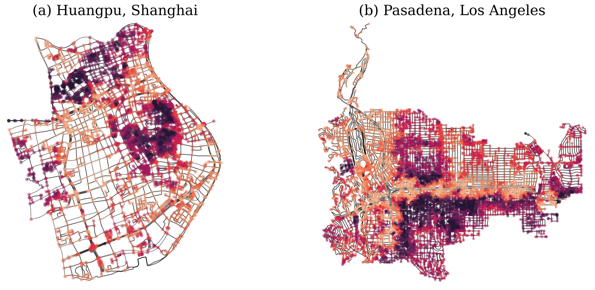

# City-Networks
City-Networks of long-range dependency 
 
<div align="center">
  
</div>


## Labels based on Eccentricity 
<div align="center">
  
</div>


## Installation
### 1. Create a virtual environment for GraphComBO
```
conda create -n citynetworks python=3.10
conda activate citynetworks
```

### 2. Install Packages
```
pip install networkx
pip install torch_geometric
pip install osmnx
pip install publib
```

## Run
Use the commands in a bash shell to generate city networks with pre-specified queries in `places.py`,
```bash
python generate_network.py --place paris
python generate_network.py --place shanghai
python generate_network.py --place la
python generate_network.py --place london
```
